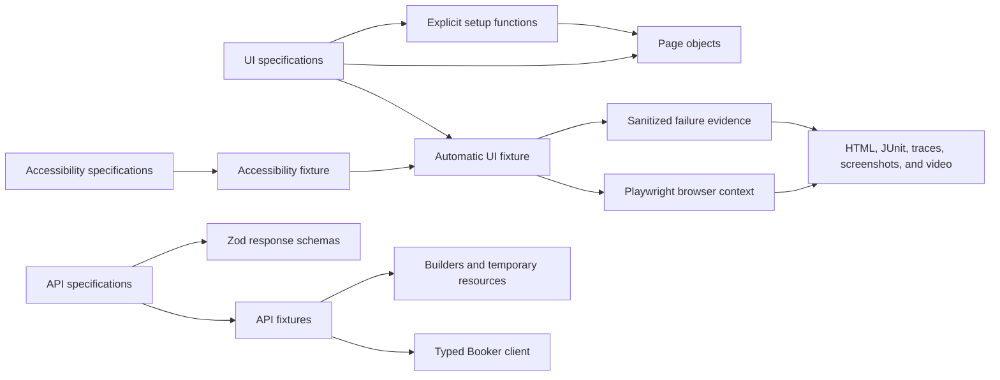

# Playwright TypeScript Automation Framework

[](https://github.com/rippin/playwright-typescript-framework/actions/workflows/ci.yml)
[](https://github.com/rippin/playwright-typescript-framework/actions/workflows/security.yml)
[](https://github.com/rippin/playwright-typescript-framework/actions/workflows/nightly.yml)

A portfolio-quality system-test framework demonstrating modern UI and API automation architecture,
risk-based delivery pipelines, accessibility, visual regression, and failure diagnostics with
Playwright and TypeScript.

The repository intentionally favors representative vertical slices over exhaustive coverage of its
public demo targets. Its focus is framework design: isolation, composition, deterministic setup,
useful evidence, and selecting the right tests at the right delivery stage.

## What This Demonstrates

| Area                      | Implementation                                                                                               |
| ------------------------- | ------------------------------------------------------------------------------------------------------------ |
| UI automation             | SauceDemo login, inventory, cart, checkout validation, and complete-purchase journeys                        |
| Browser coverage          | Chromium, Firefox, WebKit, and Pixel 7 mobile emulation                                                      |
| API automation            | Restful Booker authentication, CRUD lifecycle, persistence, negative behavior, and best-effort cleanup       |
| Contract validation       | Runtime response validation with Zod and inferred TypeScript types                                           |
| Accessibility             | Focused Axe WCAG scans and an inline ARIA snapshot for navigation semantics                                  |
| Visual regression         | Reviewed checkout-summary baseline compared in pinned Linux Chromium                                         |
| Authentication            | Playwright setup project and reusable, browser-neutral `storageState`                                        |
| Diagnostics               | Retry traces, failure screenshots/video, and sanitized page-error and network-failure attachments            |
| Framework unit tests      | Deterministic Vitest coverage for schemas, data builders, URL sanitization, and evidence redaction           |
| Delivery pipelines        | Pull-request gates, deployment verification, production-safe allowlisting, and a nightly browser matrix      |
| Test analytics            | Flakiness.io history uploaded from Playwright CI jobs through secretless GitHub OIDC                         |
| Supply-chain protection   | Dependabot, dependency review, CodeQL, npm audit, immutable Action SHAs, and restricted workflow permissions |
| Modern TypeScript tooling | Strict TypeScript 7, type-aware Oxlint, Oxfmt, Node.js 24, and reproducible npm installs                     |

## Architecture



The main ownership boundaries are:

- Tests own behavioral assertions.
- Thin page objects own locators and raw UI interactions; there is no generic base-page hierarchy.
- Plain setup functions compose prerequisite journeys such as reaching checkout.
- Fixtures manage configured dependencies, automatic listeners, and resources requiring controlled
  setup or teardown.
- API clients own transport details while schemas validate runtime contracts.
- Every UI test receives a fresh browser context, optionally initialized from reusable
  authentication state.

```text
.
├── src/
│   ├── api/          # Typed API clients and schemas
│   ├── config/       # Validated environment configuration
│   ├── data/         # Deterministic builders
│   ├── fixtures/     # UI diagnostics, accessibility, and API resources
│   ├── pages/        # Thin page objects
│   ├── reporting/    # Sanitization and diagnostic evidence models
│   └── support/      # Explicit prerequisite UI flows
├── tests/
│   ├── __screenshots__/ # Reviewed visual baselines
│   ├── api/             # API behavior and lifecycle specifications
│   ├── setup/           # Authentication setup project
│   ├── ui/              # Feature-grouped functional, accessibility, and visual tests
│   └── unit/            # Framework-internal deterministic tests
└── docs/                  # Strategy, architecture, safety model, and ADRs
```

## Risk-Based Execution

The framework does not run a full regression suite on every pull request. Coverage expands as a
change moves closer to release and at scheduled breadth checkpoints.

| Trigger               | Coverage                                                                                         |
| --------------------- | ------------------------------------------------------------------------------------------------ |
| Pull request          | Format, lint, type check, unit tests, API checks, Chromium smoke, and high-risk accessibility    |
| Test deployment       | Blocking Chromium smoke followed by regression                                                   |
| Staging deployment    | Critical smoke across Chromium, Firefox, and WebKit                                              |
| Production deployment | Explicitly allowlisted, read-only `@prod-safe` verification                                      |
| Nightly               | Regression across desktop browsers, mobile smoke, API, accessibility, and pinned visual coverage |

GitHub Actions matrix jobs provide browser-level concurrency. Playwright sharding is deliberately
omitted while the suite is small enough that runner and browser startup would outweigh its benefit.

## Reliability and Evidence

- CI permits one retry for evidence collection and uses `failOnFlakyTests`, so a retry-passing test
  still fails the gate as flaky.
- Traces are recorded on the first retry; screenshots and video are retained on failure.
- An automatic UI fixture records uncaught page errors and failed network requests without changing
  test outcomes.
- Diagnostic JSON is attached only to unexpectedly failed tests. URLs lose credentials, query
  parameters, and fragments, and common secret assignments are redacted.
- Request and response headers and bodies are not collected by the diagnostic fixture.
- HTML, JUnit, and test artifacts are retained by CI for 14 days unless a run is canceled.
- CI also publishes Playwright results and attachments to Flakiness.io for historical analysis.

## Accessibility and Visual Testing

The framework treats these checks as complementary:

- Axe identifies automatically detectable WCAG rule violations.
- ARIA snapshots protect selected accessible roles, names, states, and hierarchy.
- Visual comparisons protect stable, visually important rendering.

Visual coverage is intentionally focused on the checkout order summary. Its approved baseline is
committed under `tests/__screenshots__/` and compared only in the same pinned Playwright Linux image
used by nightly CI. `updateSnapshots: 'none'` prevents ordinary local or CI runs from silently
accepting changed output. The explicit baseline-update command and review policy are documented in
[the test strategy](./docs/TEST_STRATEGY.md#updating-visual-baselines).

## Getting Started

Prerequisites:

- Node.js 24
- npm 11

```bash
git clone https://github.com/rippin/playwright-typescript-framework.git
cd playwright-typescript-framework
nvm use
npm ci
npx playwright install chromium
cp .env.example .env
npm run quality
npm run test:smoke
```

The default targets and credentials belong to public demo applications. Environment values are
validated at startup, and `.env` files are ignored. Install Firefox and WebKit before running the
local cross-browser suite:

```bash
npx playwright install firefox webkit
```

## Commands

| Command                       | Purpose                                                  |
| ----------------------------- | -------------------------------------------------------- |
| `npm run quality`             | Format check, lint, type check, and framework unit tests |
| `npm run test:smoke`          | Chromium smoke coverage                                  |
| `npm run test:ui`             | Chromium functional UI suite                             |
| `npm run test:api`            | Restful Booker API suite                                 |
| `npm run test:a11y`           | Complete accessibility suite                             |
| `npm run test:a11y:high-risk` | Pull-request accessibility subset                        |
| `npm run test:visual`         | Linux Chromium visual suite                              |
| `npm run test:cross-browser`  | Chromium, Firefox, and WebKit functional suites          |
| `npm run test:mobile`         | Pixel 7 Chromium smoke coverage                          |
| `npm run test:prod-safe`      | Explicitly production-safe verification                  |
| `npm run report:show`         | Open the most recent local Playwright HTML report        |

## Security Boundaries

- GitHub Actions are pinned to immutable commit SHAs and default to read-only permissions.
- Dependency changes receive high-severity review; CodeQL and npm audit run independently.
- Generated authentication state, `.env` files, reports, and private artifacts are excluded from
  source control.
- Production execution is an explicit `@prod-safe` allowlist; smoke or regression tags do not grant
  production authorization.
- Visual baselines require human review and cannot update implicitly.
- Future AI triage is advisory only and cannot change results, code, issues, deployments, or visual
  baselines.
- Flakiness.io attachment uploads are approved for the public demo targets only; private systems
  require a separate data-security review.

See [SECURITY.md](./SECURITY.md) and the [AI safety model](./docs/AI_SAFETY.md) for the complete
boundaries.

## Design Decisions and Tradeoffs

- [Explicit UI setup instead of page-state fixtures](./docs/adr/0001-explicit-ui-setup.md) keeps
  navigation visible and fixture graphs small.
- [Risk-based execution](./docs/adr/0002-risk-based-execution.md) prioritizes fast pull-request
  feedback while preserving nightly breadth.
- [The native TypeScript toolchain](./docs/adr/0003-native-typescript-toolchain.md) uses TypeScript 7
  and Oxc tooling while retaining Playwright-specific lint rules.
- Public demo applications make this repository reproducible without private infrastructure, but
  their availability and defects remain outside the framework's control.
- The suite is intentionally representative. Adding more tests that repeat established patterns
  would increase maintenance without demonstrating additional framework capability.

The detailed [framework plan](./FRAMEWORK_PLAN.md), [architecture](./docs/ARCHITECTURE.md), and
[test strategy](./docs/TEST_STRATEGY.md) are the source of truth for scope and ownership.

## Next Phase

The non-AI v1 foundation is complete. A future v2 may add opt-in AI-assisted failure triage with
structured output, sanitized evidence, and a versioned evaluation harness. AI output will remain
advisory and will never alter the authoritative Playwright result.
